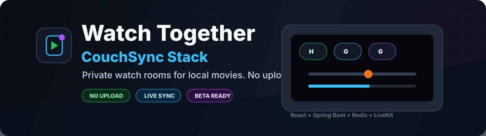

<p align="center">
  
</p>

# Spectemus Simul

## Посмотрите свой фильм вместе

**Spectemus Simul** помогает посмотреть локальное видео вместе с близким
человеком в одной домашней сети. Вы запускаете приложение на компьютере host-а,
создаёте комнату и отправляете ссылку или QR-код. Гость открывает ссылку в
браузере — видео, звук и управление воспроизведением синхронизируются.

Это не видеохостинг: исходный файл остаётся на компьютере host-а. Он не
загружается и не хранится на сервере приложения. Во время просмотра гостю
передаётся медиапоток по локальной сети — как в любом совместном видеозвонке.

> **Статус:** ранняя desktop-preview для Mac и Windows. Она уже подходит для
> домашней проверки «я и один-два гостя», но это ещё не подписанный релиз.

## Подходит, если вы хотите

- включить свой фильм на Mac или Windows и посмотреть его вместе дома;
- быстро отправить приглашение ссылкой, QR-кодом или через мессенджер;
- синхронно ставить видео на паузу и перематывать его;
- переписываться в чате во время просмотра;
- не передавать оригинальный файл фильма в облако приложения.

Сейчас **не подходит**, если вы с гостем находитесь в разных городах, хотите
смотреть защищённые стриминги (Netflix, Кинопоиск и подобные) или ждёте
гарантированной поддержки каждого старого или редкого видеофайла. Режим для
интернета и надёжная конвертация форматов — следующие отдельные этапы, а не
скрытые обещания текущей preview.

## Что понадобится

| Кому  | Что нужно                                                                                    |
| ----- | -------------------------------------------------------------------------------------------- |
| Host  | Mac с Apple Silicon или Intel либо Windows x64, установленное приложение и фильм на диске.   |
| Гость | Компьютер с Chrome или Edge. Устанавливать Spectemus Simul гостю не нужно.                   |
| Сеть  | Оба устройства подключены к одному домашнему роутеру: Wi-Fi и Ethernet в этой сети подходят. |
| Видео | Для первого просмотра берите MP4/M4V с H.264 + AAC или WebM с VP8/VP9 + Opus.                |

Комната рассчитана максимум на **четырёх участников вместе с host-ом**. Телефон
можно использовать для QR-кода и передачи ссылки, но просмотр гостя в preview
рассчитан на настольный браузер.

## Установка preview

Готовая preview-сборка не требует Docker, Node.js или ручной настройки портов.
Она выпускается через [Desktop installer в GitHub Actions](https://github.com/Delakroa/spectemus-simul/actions/workflows/desktop-installer.yml).

1. Откройте ссылку выше и выберите последний запуск `Desktop installer` с
   зелёными галочками.
2. Внизу страницы запуска скачайте **один** подходящий artifact:

   | Ваш компьютер host-а    | Artifact                        |
   | ----------------------- | ------------------------------- |
   | Mac с M1/M2/M3/M4       | `spectemus-simul-macos-arm64-…` |
   | Mac с процессором Intel | `spectemus-simul-macos-x64-…`   |
   | Windows 10/11, 64-bit   | `spectemus-simul-windows-…`     |

3. GitHub скачает ZIP-архив. Распакуйте его:
   - на **Mac** откройте `.dmg` и перетащите `Spectemus Simul.app` в
     «Программы»;
   - на **Windows** запустите установщик `.exe` из распакованной папки.

Preview пока не подписана сертификатом Apple или Microsoft. Поэтому macOS может
попросить подтверждение при первом запуске, а Windows — показать SmartScreen.
Продолжайте только если скачали artifact из этого репозитория и из проверенного
зелёного запуска.

<details>
<summary>macOS пишет, что приложение «повреждено»</summary>

Это ограничение неподписанной preview, а не поломка приложения. Убедитесь, что
приложение лежит в «Программах», откройте «Терминал» и выполните:

```bash
xattr -cr "/Applications/Spectemus Simul.app"
```

После этого запустите приложение снова. Команда снимает карантин только с этого
конкретного приложения; используйте её лишь для скачанной из репозитория сборки.

</details>

Artifacts GitHub Actions хранятся 14 дней. Это временный способ установки для
preview; подписанный стабильный релиз появится на странице
[Releases](https://github.com/Delakroa/spectemus-simul/releases).

## Первый совместный просмотр

1. На компьютере host-а откройте **Spectemus Simul**. Оставьте приложение
   запущенным до конца просмотра.
2. Создайте комнату и укажите своё имя.
3. Нажмите кнопку приглашения: скопируйте ссылку, покажите QR-код или отправьте
   её через мессенджер.
4. Гость, подключённый к той же домашней сети, открывает **полную** ссылку в
   Chrome или Edge, вводит имя и входит в комнату.
5. Host выбирает фильм в области просмотра. Перед публикацией приложение
   проверит, может ли браузер открыть и передать этот файл.
6. Нажмите Play. Host управляет паузой и перемоткой; у каждого участника есть
   собственные кнопки громкости и выключения звука.

Не заменяйте адрес в приглашении на `127.0.0.1` или `localhost`: это адрес
только для самого host-компьютера. Приложение само выбирает свободный LAN-порт,
поэтому порт в ссылке может быть не `8088` — это нормально. Гостю всегда нужно
отправлять ссылку целиком.

## Какие видео открываются

| Формат                                       | Ожидание                                                                                                                     |
| -------------------------------------------- | ---------------------------------------------------------------------------------------------------------------------------- |
| MP4/M4V с H.264 + AAC                        | Базовый и рекомендуемый путь.                                                                                                |
| WebM с VP8/VP9 + Opus                        | Базовый путь.                                                                                                                |
| MOV, MKV, AVI, MPEG, TS, WMV, FLV            | Можно попробовать. Поддержка зависит от кодеков в конкретном файле и браузере host-а; перед стартом будет реальная проверка. |
| HEVC, DTS, редкие кодеки, повреждённые файлы | Могут не открыться. Пока нет встроенной конвертации «любого формата».                                                        |
| DRM-защищённые сервисы и вкладки стримингов  | Не поддерживаются.                                                                                                           |

Расширение файла само по себе ничего не гарантирует: например, один MKV может
пройти проверку, а другой — нет. Если фильм не прошёл, для первой проверки
попробуйте обычный H.264/AAC MP4.

## Важные ограничения preview

- **Только одна сеть.** Сейчас host и гость должны быть в одной локальной
  сети. Открыть LAN-приглашение через интернет нельзя.
- **Голосовой чат зависит от HTTPS.** В обычной HTTP-сессии домашней сети
  браузер может не дать доступ к микрофону. Видео и текстовый чат от этого не
  зависят; для разговора пока подойдёт отдельный звонок в мессенджере.
- **Host — источник просмотра.** Если host закроет приложение, выключит
  компьютер или потеряет сеть, гостевой просмотр остановится.
- **Нет защиты от записи.** Участник, который видит медиапоток, технически
  может записать экран. Используйте только контент, которым вы вправе делиться.
- **Нет автообновления и подписи.** Preview нужно обновлять вручную. Это будет
  исправлено до публичного релиза.

## Если что-то не работает

| Симптом                       | Что проверить сначала                                                                                                                             |
| ----------------------------- | ------------------------------------------------------------------------------------------------------------------------------------------------- |
| У гостя не открывается ссылка | Оба компьютера в одной сети; host-приложение открыто; в ссылке указан LAN-адрес host-а, а не `127.0.0.1`/`localhost`; ссылка скопирована целиком. |
| Нет звука                     | Нажмите на область видео у гостя, проверьте локальный регулятор громкости и mute в плеере, затем системную громкость.                             |
| Фильм не публикуется          | Начните с H.264/AAC MP4. Для MOV/MKV и других форматов прочитайте результат проверки в приложении — она зависит от кодека.                        |
| Видео у гостя зависло         | Гость нажимает «Видео зависло»; host получает сигнал и может безопасно перезапустить показ, сохранив позицию.                                     |
| В приглашении другой порт     | Это штатный свободный порт, выбранный приложением. Отправьте ссылку как есть.                                                                     |

Если проблема повторяется, приложите в feedback описание: какая система была
host-ом и guest-ом, тип сети, формат файла и что происходило перед ошибкой. Не
прикладывайте сам фильм и не публикуйте приватную invite-ссылку.

## Для разработчиков

Если вы хотите запускать исходный код, а не готовую preview-сборку, нужны
Node.js 24, pnpm и Docker Desktop. Это отдельный режим разработки:

```bash
git clone https://github.com/Delakroa/spectemus-simul.git
cd spectemus-simul
pnpm install
pnpm infra:up
```

После запуска откройте `http://127.0.0.1:8088`. Остановить локальный стек:

```bash
pnpm infra:down
```

Полный набор команд, архитектура, API-контракты и история решений находятся в
[docs/README.md](docs/README.md). Перед изменением кода прочитайте
[CONVENTIONS.md](docs/CONVENTIONS.md).

## Обратная связь

Spectemus Simul развивается через реальные домашние проверки Mac ↔ Windows.
Самые полезные отзывы — те, где понятно: получилось ли создать комнату,
подключился ли гость, был ли звук, работали ли пауза/перемотка и какой формат
видео использовался. В приложении есть форма feedback; она не должна содержать
фильм, его путь на диске или личные данные.
